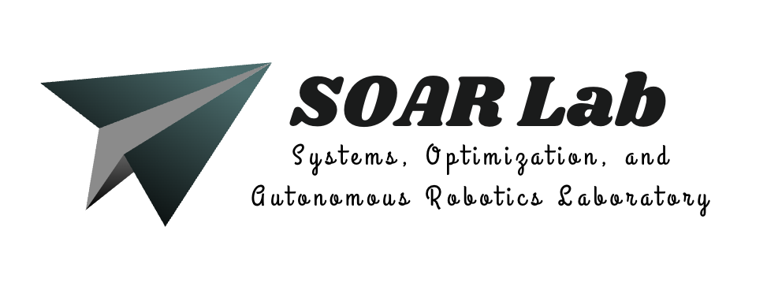

# 🧠 SOAR Lab @ The Ohio State University  

> **Systems, Optimization, and Autonomous Robotics Lab** [🌐](https://goswami78.github.io/SOAR_Lab/index.html)

  

## 📬 Contact

**Dr. Debdipta Goswami**  
Assistant Professor  
Department of Mechanical and Aerospace Engineering  
**The Ohio State University**  

🏢 **Office:** E510 Scott Laboratory, 201 W. 19th Street, Columbus, OH 43210  
🔬 **Lab:** W078 Scott Laboratory  
📞 **Phone:** +1 (614) 247-6063  
✉️ **Email:** goswami.78 [@] osu [DOT] edu  
🌐 [MAE Faculty Profile](https://mae.osu.edu/people/goswami.78) 

## 🚀 Research Focus (including, but not limited to)
- Data-driven learning and control of dynamical systems
- Operator theoretic description of control systems
- Autonomy in drone operation

---

## 🧩 Featured Projects
| Project | Description |
|----------|-------------|
| [KQ-LMPC](https://github.com/santoshrajkumar/kq-lmpc-quadrotor) | Real-Time Koopman-based Linear MPC for Quadrotors *(IEEE RA-L 2025)* |

---

## 🧑‍🔬 Team
## 🧑‍🔬 Team

| Member | Role | Profile |
|:--------|:------|:--------|
| **[Santosh Rajkumar](https://github.com/santoshrajkumar)** | Ph.D. Student | [🐙 GitHub](https://github.com/santoshrajkumar)  [🔗 Homepage](https://scholar.google.com/citations?user=) |
| **[Chenyu Yang](https://github.com/chenyu-yang)** | M.S. Student — *Hardware Integration, PX4-based Flight Experiments* | [🐙 GitHub](https://github.com/chenyu-yang) |

---

### 💫 Get Involved
Follow our repositories and research at  
👉 [github.com/SOARLabOSU](https://github.com/SOARLabOSU)
